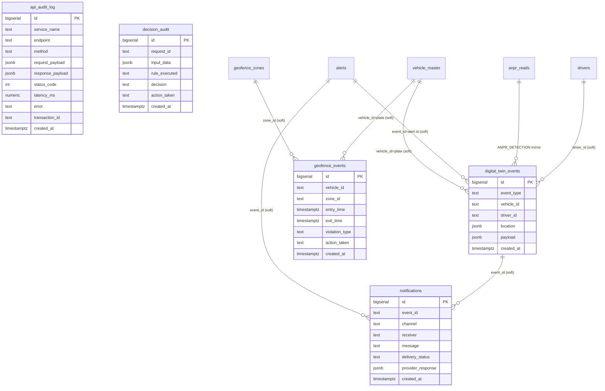

# RDS Single-Source-of-Truth — ER Diagram (Audit & Persistence Framework)

**Migration:** `infra/postgres/migrations/0003_audit_persistence.sql` (also in `infra/postgres/init.sql`).
**Schema:** `jnpa` (PostgreSQL / TimescaleDB / RDS). All timestamps `timestamptz` (UTC).

The five new tables are the cross-cutting audit/event spine. They reference the
existing operational tables by **soft keys** (vehicle plate, zone id, alert id,
driver id) rather than hard FKs, so an audit row always survives even if the
referenced operational row is later changed or purged (audit rows are immutable
history).

## Entity-relationship (new spine + touch-points)

## Column contracts

### `api_audit_log` — every external API request/response
| Column | Type | Notes |
|---|---|---|
| id | bigserial PK | |
| service_name | text NOT NULL | `vahan` `sarathi` `fastag` `ulip` `eseal` `form13` `icegate` `weighbridge` `parking` `carbon` … |
| endpoint | text | `"<METHOD> <path>"` |
| method | text | GET/POST/… |
| request_payload | jsonb | truncated to 8 KB |
| response_payload | jsonb | truncated to 8 KB |
| status_code | int | NULL on transport error |
| latency_ms | numeric(10,2) | wall-clock of the call |
| error | text | set on non-2xx / exception |
| transaction_id | text | `X-Correlation-ID` / `X-Request-ID` |
| created_at | timestamptz | default now() |

**Indexes:** `(service_name, created_at DESC)`, `(transaction_id)`, `(created_at DESC)`.

### `digital_twin_events` — every operational / AI event
`event_type` ∈ `VEHICLE_DETECTED · ANPR_DETECTION · GEOFENCE_VIOLATION · PARKING_VIOLATION · ROUTE_DEVIATION · CONGESTION_ALERT · CUSTOMS_ALERT · AI_EVENT`.
`location` holds `{lat,lon,gate_id,segment_id,camera_id,zone_id}` (sparse).
**Indexes:** `(event_type, created_at DESC)`, `(vehicle_id, created_at DESC)`, `(driver_id, created_at DESC)`, `(created_at DESC)`.

### `notifications` — delivery audit trail
`channel` ∈ `webpush · sms · ws · email`. `delivery_status` CHECK ∈ `PENDING · SENT · DELIVERED · FAILED · SKIPPED · NO_SUBSCRIPTION`.
**Indexes:** `(created_at DESC)`, `(receiver, created_at DESC)`, `(delivery_status, created_at DESC)`, `(event_id)`.

### `decision_audit` — durable replacement for the in-memory DecisionRing
`rule_executed` = the orchestrated api/chain; `decision` = the chosen path (`LIVE_PRIMARY`/`CACHED`/`PROVISIONAL`/…); `action_taken` = `PRIMARY`/`FALLBACK`.
**Indexes:** `(created_at DESC)`, `(request_id)`, `(rule_executed, created_at DESC)`.

### `geofence_events` — zone enter/exit + dwell violations
`violation_type` ∈ `ENTER · EXIT · ILLEGAL_PARKING · ABANDONED`. `zone_id` soft-refs `geofence_zones.id`.
**Indexes:** `(vehicle_id, entry_time DESC)`, `(zone_id, entry_time DESC)`, `(created_at DESC)`.

> Vehicle-lookup and timestamp indexes are present on every table per the migration
> requirement, so plate-scoped audit queries and time-range analytics are index-served.
